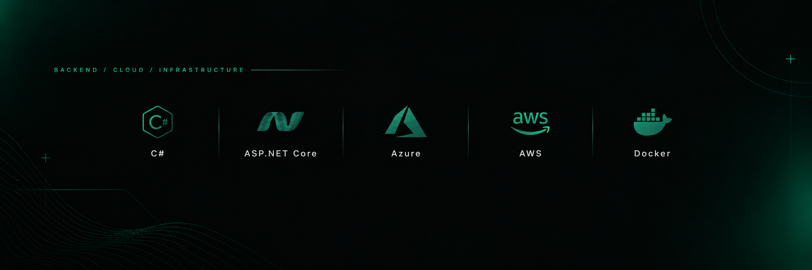

  

<h1 align="center">Efe Berk Kılıç</h1>

  <strong>Backend Developer · Cloud Engineering</strong>

  Building scalable backend systems, learning cloud architecture, and creating practical developer-focused projects.

  

---

## About Me

- Backend development with **C# & ASP.NET Core**
- Focused on **Cloud Engineering**
- Learning **Azure & AWS**
- Interested in **Clean Architecture, REST APIs and distributed systems**
- Building real-world projects and developer tools

---

## Backend & Cloud

  

---

## Tech Stack

  

---

## GitHub Overview

  
  

---

## Current Direction

  Backend Engineering → Cloud Engineering → Distributed Systems

  <strong>Build · Deploy · Scale · Improve</strong>

---

  <a href="https://efeberk.dev">efeberk.dev</a>

